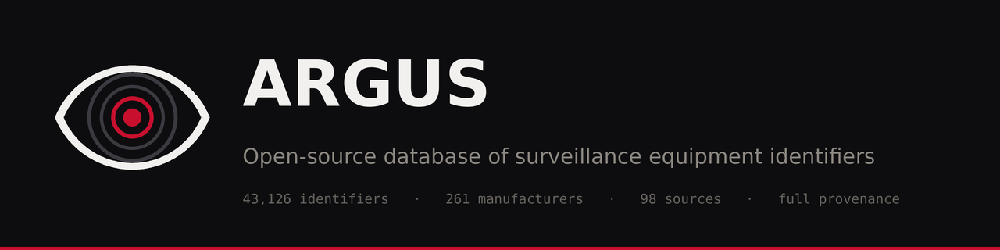

<div align="center">



# Argus

**Open-source database of surveillance equipment identifiers**

[](LICENSE)
[](LICENSE-DATA)
[](LICENSE-DOCS)
[](CHANGELOG.md)
[](#whats-in-the-dataset)

[](https://github.com/kevwillow/argus-db/actions/workflows/public-suite.yml)
[](https://github.com/kevwillow/argus-db/actions/workflows/export-contract.yml)
[](https://github.com/kevwillow/argus-db/actions/workflows/doc-claims.yml)
[](https://github.com/kevwillow/argus-db/actions/workflows/cli-smoke.yml)
[](https://github.com/kevwillow/argus-db/actions/workflows/lint.yml)

[](#what-is-argus)

</div>

> [!WARNING]
> **Argus is in active development and is not complete.** The data may not be 100% accurate
> and may contain anomalies. Treat every row as provenance-tracked evidence to verify, not
> as ground truth.

> **New here?** Start with [`docs/USER_GUIDE.md`](docs/USER_GUIDE.md) for a plain-language
> overview of what Argus is and how to use the data. This README is a project summary; the
> user guide walks through concrete usage.

### At a glance

| | | | |
|---|--:|---|--:|
| Active identifiers | **43,126** | Device categories | **20** |
| Manufacturers | **261** | Identifier types | **58** |
| Upstream sources | **98** | Behavioral signatures | **214** |

## What is Argus

Argus tracks the model numbers, MAC ranges, FCC grantee codes, hostnames, certificate identifiers, and BLE company IDs of surveillance equipment used by US law enforcement and adjacent operators. That includes **Hikvision CCTV cameras**, **Cellebrite forensic extraction devices**, **Anduril counter-drone systems**, **Flock Safety license plate readers**, **Geotab fleet telematics**, **Rohde & Schwarz IMSI catchers**, and dozens of other surveillance vendor categories.

Argus is a database rather than a real-time monitor. It lists the wireless and regulatory fingerprints of fixed and mobile surveillance equipment so that downstream tools (Lynceus, Rayhunter, or any other RF scanner) can alert when a matching device appears nearby. Every entry comes from public sources: regulatory registries, public-records procurement data, open-source intelligence repositories, manufacturer documentation, and academic research.

Tools to surveil people are abundant; tools to detect surveillance are not. The asymmetry favors the surveillor. Argus narrows the gap by making vendor identifiers queryable in a single place with full provenance for every row.

**Argus is for *detection* of public-record-derived surveillance equipment identifiers, NOT for evasion of legitimate law-enforcement interaction.** Argus operates as a passive identification database: identifiers and metadata only, no active interference, no jamming, no attack tooling, no deanonymization of individual officers or agencies. The scope is *equipment categories*, not people.

## Quickstart

```bash
git clone https://github.com/kevwillow/argus-db.git
cd argus-db

# what this clone ships: schema version, export timestamps, record counts
python3 argus_cli.py status

# look up a Flock Safety ALPR MAC
python3 argus_cli.py query e4:aa:ea:80:a1:9b
```

Both commands work on a bare clone, with no `pip install` and no database. The export files under `exports/` are tracked and populated, and `status` and `query` read them.

**About the database.** The SQLite database `db/argus.db` is **not** distributed through this repository and is absent from the published tree; the exports are the published data artifact. `status` and `query` fall back to `exports/` automatically when the database is missing, and say so on stderr. `--source exports` forces that fallback, `--source db` requires the canonical database and fails without it. Counts the exports genuinely cannot see (the manufacturer and source registries, raw observations, extraction-run history) print as `unavailable (requires canonical DB)`, never as a fabricated zero. See [`docs/engineering/SETUP.md`](docs/engineering/SETUP.md) for what a clone actually contains, the schema-rebuild path, the source-ingest pipeline dependencies, and optional API keys.

## What's in the dataset

At v1.8.0:

- **43,126 active canonical identifiers**, the things you query against (MAC ranges, BLE service UUIDs, FCC grantee codes, vendor-controlled hostnames, and more). The most recent release (v1.8.0) bundles two migrations: `0059` lands the WAVE_9.0 carve-out harvest, and `0060` lands the strict-8.4 category amendment the board ratified. Active moves 43,088 → 43,126, the standard feed 983 → 1,014, high-confidence 501 → 504. Nothing was superseded this cycle, so the +38 is clean growth with no withdrawals. The high-confidence +3 is recategorization rather than new detection: those three rows were already in the database and shipped in no feed because `device_category='unknown'` binned them out first. See the release notes below for the breakdown.
- **261 manufacturers**, surveillance vendors classified by what they make. 92 of those are OEM arms, the rebadging brands a parent vendor sells through, and they stay hidden from vendor lists by default.
- **98 upstream sources.** Every identifier traces back to at least one of them. 42,261 of the 43,126 CSV rows cite that source with a direct `http(s)` URL you can open. The remaining 865 cite a non-URL provenance token instead: `wave_i_aggregate:` (660 rows), `apkcombo:` (188), `APK extract:` (12), `argus-internal:` (3), `manufacturer_app:` (2). All 865 are `source_type='manufacturer_app'` rows whose upstream artifact is a vendor application package rather than a web page, so there is no page to link. They are attributed and auditable, but not one-click verifiable. [Provenance discipline](#provenance-discipline) decodes each token.
- **20 device categories**, what kind of surveillance equipment each identifier is associated with (ALPR, IMSI catcher, body cam, drone, CCTV camera, network surveillance, fleet telematics, Bluetooth tracker, smart lock, smart-home hub, etc.)
- **58 identifier types**, the kinds of identifiers tracked (MAC, OUI, FCC grantee code, hostname, BLE UUID, IMEI TAC, network discovery protocol pattern, etc.)
- **214 behavioral signatures**, cellular-control-plane patterns associated with IMSI-catcher detection.

An *identifier* is a piece of data that pinpoints a vendor's hardware on a wire or radio band: an OUI (the first 24 bits of a MAC address, which maps to a manufacturer), a BLE service UUID broadcast by a device, an FCC grantee code on a regulatory filing, or a hostname embedded in a vendor's companion app. When a downstream scanner observes one of these in the wild, it can use Argus to identify what vendor and what device category produced it.

A *manufacturer* is a vendor that ships surveillance equipment. A *device category* is the kind of equipment (ALPR, body cam, etc.). A *source* is a public dataset that contributed observations to Argus.

## How to use the exports

Argus ships four export files for downstream consumption. Pick the one that matches your use case.

- **`exports/argus_export_high_confidence.json`** (504 records), runtime scanners (Lynceus). Strict confidence floor (≥70); excludes crowdsourced and inferred sources, except for named community Flock-hunt sources. Every record carries exactly four keys: `argus_record_id`, `description`, `pattern`, `pattern_type`. There is no severity field and no per-row confidence value in this feed. Severity ranking is deliberately left to the operator.
- **`exports/argus_export.json`** (1,014 records), broader scanner watchlists. Looser confidence floor (≥30); US scope filter. Same four-key record shape as the high-confidence feed.
- **`exports/argus_export.csv`** (43,126 records), bulk import, analysis, or re-derivation. All active rows. Apply your own filters at import.
- **`exports/argus_export_behavioral_signatures.json`** (132 records), cellular-band scanners (Rayhunter). Different record shape from the other two JSON feeds: `argus_record_id`, `signature_name`, `cellular_generation`, `confidence`, `threshold_json`. `threshold_json` is populated on 55 of the 132 and null on the rest, and `cellular_generation` on 19 of the 132, so treat both as optional.

**Confidence scores in plain language:** confidence is on a 0-99 scale. Anything ≥70 is strong attribution from at least one canonical source. Anything ≥85 has been cross-corroborated by an independent second source. The high-confidence export is what you ship to a scanner that's going to alert; the rich CSV is what you query against when you want all the context.

**`argus_record_id` is a pattern key, not a row id.** It is a 16-hex-char stable hash that survives export regeneration and source-attribution changes, which makes it the right handle for tracking a *pattern* across export versions. It is **not** unique per row. The CSV carries 43,096 distinct `argus_record_id` values across 43,126 rows: 15 ids are shared by more than one row, covering 45 rows in total. The most-shared id covers six rows. Do not use it as a primary key and do not join on it without expecting fan-out. For row identity, use the `id` column, which is the canonical `identifiers` row id.

**Blank `confidence` means unscored, not zero.** 174 of the 43,126 CSV rows ship an empty `confidence`. That is a distinct state from an explicit `0`, which 262 rows do carry. The blank rows are otherwise fully provenanced: all 174 carry an `http(s)` `source_url`. Handle them as their own class. Coercing blank to `0` buckets 174 attributed rows as lowest-confidence; coercing to `100` ships them to a scanner. Neither is right, so filter them out explicitly or route them to review.

For walkthroughs (querying the CSV, building a watchlist, integrating with a scanner), see [`docs/USER_GUIDE.md`](docs/USER_GUIDE.md). For the engineering setup, see [`docs/engineering/SETUP.md`](docs/engineering/SETUP.md).

## Coverage scope (honest)

Argus covers surveillance equipment used by US law enforcement and adjacent operators, organized across these device categories:

- **ALPR (automated license plate readers)**, Flock Safety, Genetec, Rekor, Vigilant Solutions
- **IMSI catchers**, Harris, Digital Receiver Technology, Engility, KeyW, Jacobs, Septier, Rohde & Schwarz
- **Body cameras**, Axon, Getac, Reveal, WatchGuard Video
- **Police radios**, Kenwood, Motorola Solutions (multi-purpose subset)
- **Drones**, DJI, Parrot, BRINC, Skydio
- **Counter-drone systems**, Anduril, Dedrone, DroneShield, Fortem, Citadel Defense, Black Sage, D-Fend, AeroDefense, Echodyne, Liteye, Robin Radar, MyDefence, Sensofusion
- **CCTV / IP cameras**, Hikvision, Dahua, Axis, Avigilon, Verkada, Eagle Eye Networks, Rhombus, Hanwha, Milestone, Pelco, Uniview, Tiandy, Vivotek (NDAA §889 attribution preserved on Hikvision/Dahua/Uniview/Tiandy)
- **Persistent surveillance**, Elbit Systems of America, General Atomics, TCOM, Persistent Surveillance Systems (aerostats, towers, strategic-altitude platforms)
- **Through-wall radar**, Camero, NIITEK, TiaLinx (UWB; FCC §15.519 LE-only carveout)
- **Fleet telematics**, Geotab, Verizon Connect, Samsara, Motive, Lytx, Omnitracs
- **Electronic monitoring (ankle monitors)**, BI Incorporated, Attenti, STOP, Sentinel Offender Services, Track Group
- **Gunshot detection**, SoundThinking (ShotSpotter)
- **Forensic extraction tools**, Cellebrite, Magnet Forensics, Berla, Hak5
- **Face recognition**, Clearview AI, BriefCam
- **Concealed surveillance cameras**
- **Multi-purpose vendors**, when a vendor's equipment can't cleanly map to a single device category (e.g., Cradlepoint, Sierra Wireless, L3Harris, Northrop Grumman, Lockheed Martin, Trimble, Bosch Security Systems), they're flagged `device_category='unknown'` and excluded from the high-confidence Lynceus export to avoid false-positive risk.

**What's NOT covered:**

- Generic consumer electronics (router OUIs, phone IMEIs, undifferentiated smart-home noise) are not surveillance equipment and stay out of scope. The exception is the narrow set of consumer devices whose wireless signature is a documented surveillance or covert-tracking vector: BLE smart locks (`smart_lock`), smart-home hubs (`smart_home_hub`), pet and kid cellular trackers, and Bluetooth trackers are admitted for that reason, not as general IoT coverage.
- Military signals intelligence beyond what's discoverable via public regulatory and procurement records.
- Real-time deployment status. Argus tells you what an identifier *is*; not whether it's currently deployed near you. That's the downstream scanner's job.
- Vendors whose surveillance offering isn't public-record attestable. If we can't trace it back to a citable source, it doesn't ship.

Coverage is intentionally narrow per category. Argus lists 261 vendors, 92 of them OEM arms that exist to attribute a rebadged device back to its real maker, and most categories carry 3-13 vendors rather than hundreds. Expansion comes from community contributions and future research.

## Current release

**v1.8.0** bundles two migrations that queued behind gates which closed after v1.7.0 shipped:
`0059` lands the WAVE_9.0 carve-out harvest, and `0060` lands the strict-8.4 category
amendment the board ratified.

| Feed | v1.7.0 | v1.8.0 | |
|---|--:|--:|---|
| Active identifiers | 43,088 | **43,126** | +38, no withdrawals |
| Standard (Lynceus) | 983 | **1,014** | +31 |
| High-confidence | 501 | **504** | +3 |
| Behavioral signatures | 132 | **132** | flat |

`schema_version` is unchanged at **35**, because neither migration carries DDL.

**If you run a scanner:** the standard feed grows by 31 entries and one pre-existing stem is
re-rendered (`autel` → `autelevo` + `autelrobotics`, +1 net). Every v1.7.0 feed entry is still
present. Migration `0059` admits 38 rows and only 14 reach the feed: 18 `ble_local_name` rows
drop at the CP50 template gate and 6 `ssid_pattern` rows route to `ssid_pattern_fp_hold`,
because bare stems like `flock` and `stingray` were matching ordinary network names. The hold
rejects the whole row, so **Hak5 ships in neither feed at v1.8.0**. That is the false-positive
discipline from v1.7.0 doing its job on a fresh harvest, not a shortfall.

**Read the high-confidence +3 carefully.** All 38 of `0059`'s rows are `crowdsourced` and carry
NULL `geographic_scope`, so none can clear the high-confidence floor. The entire 501 → 504
movement is `0060`'s three `geographic_scope='global'` rows, which were already in the database
and shipped in no feed because `device_category='unknown'` bins out first. That is rows becoming
eligible, not devices newly found.

**Since the v1.8.0 tag.** `main` is 18 commits ahead of the `v1.8.0` tag. Migration
`0064_mac781_argus_export_anchor_repair` was applied after the tag and the exports were
regenerated from it. Three of the four export files carry `exported_at 2026-08-21T12:06:18Z`
rather than the v1.8.0 fingerprint recorded in the changelog: `argus_export.csv`,
`argus_export.json` and `argus_export_high_confidence.json`.
`argus_export_behavioral_signatures.json` was not regenerated. Its blob is identical at the
`v1.8.0` tag and at `main`, and it still carries its own earlier
`exported_at 2026-08-20T17:48:39Z`. No feed count moved: 43,126 active
identifiers, 1,014 standard, 504 high-confidence, 132 behavioral, `schema_version` still 35. That
work and this documentation-accuracy pass are written up as **v1.8.1** in the changelog. Nothing
is tagged.

Full version-by-version history, from v1.0.0 through v1.8.1, lives in
[`CHANGELOG.md`](CHANGELOG.md).

## Downstream consumers

Argus is designed as a producer of detection data for downstream RF-scanner consumers:

- **[Lynceus](https://github.com/kevwillow/lynceus-warden)** (Raspberry-Pi-class RF security monitor), consumes the JSON exports; matches on `{pattern, pattern_type}` against live RF observations.
- **[Rayhunter](https://github.com/EFForg/rayhunter)** (cellular IMSI-catcher detector on supported modems), consumes the behavioral signatures export.
- **Operator-side combined deployment**, an operator may run Lynceus + Rayhunter together; the two exports are non-overlapping (wire-observable patterns vs cellular-control-plane behavior).

**Operator-stack self-exclusion**: Argus operator-side hardware MUST NOT appear in the high-confidence export. That covers Lynceus host hardware (Raspberry Pi OUIs) and Rayhunter-supported modems (Orbic RC400L, FY UZ801, PinePhone Quectel, Wingtech CT2MHS01, T-Mobile TMOHS1, TP-Link M7350/M7310). This is mandatory regardless of source confidence.

## Testing

The suite is tiered by the resource a test needs, so a bare clone can run it.

```bash
# public tier: everything that runs on a fresh clone, no database, no raw artifacts
python3 -m pytest tests/ -q

# maintainer tier: turn every resource skip into a hard failure
ARGUS_REQUIRE_ALL=1 python3 -m pytest tests/ -q
```

Tests that need the canonical database are marked `canonical_db`. Tests that need the ingest
inputs under `raw/` are marked `raw_artifacts`. Neither resource is distributed: `db/argus.db` is
not published and `raw/` is gitignored. On a public clone those tests **skip** rather than fail,
so the public tier is green on a clone that contains only what this repository ships.

`ARGUS_REQUIRE_ALL=1` is the maintainer switch. It converts those skips into failures, so a
machine that is supposed to hold both resources cannot pass the suite by silently skipping the
part of it that touches them. Run both from the repository root.

## How to contribute

External contribution is welcome:

- **New identifiers / new sources**, submit a GitHub PR with per-row source citations. Every observation needs a concrete file path (e.g., `https://github.com/Owner/Repo/blob/<sha>/<path>#L<line>`), not just a bare repo URL.
- **No PII**, Argus identifies *equipment*, not people. Officer names, badge numbers, home addresses don't ship.
- **Provenance-first**, promotion to the canonical state requires a `raw_observations` ancestor + cited source band. The discipline framework is documented in [`docs/engineering/PROJECT_BIBLE.md`](docs/engineering/PROJECT_BIBLE.md) and [`docs/engineering/BIBLE_AMENDMENTS.md`](docs/engineering/BIBLE_AMENDMENTS.md).
- **Vendor attribution disputes**, open a GitHub issue. Argus's doctrinal grounding is Feist factual-data + 17 USC §1201(j) security-research exemption + 37 CFR §201.40(b) + nominative fair use.

For schema-impacting changes (new tables, new `identifier_type` enum values, new `source_type` bands), coordinate with the amendment process documented in [`docs/engineering/BIBLE_AMENDMENTS.md`](docs/engineering/BIBLE_AMENDMENTS.md), schema changes pair with formal amendment entries.

## Documentation map

- [`docs/USER_GUIDE.md`](docs/USER_GUIDE.md), start here. Plain-language overview, walkthroughs, coverage caveats.
- [`CHANGELOG.md`](CHANGELOG.md), version-by-version history (v1.0.0 through v1.8.1).
- [`CREDITS.md`](CREDITS.md), per-source attribution and per-vendor lexicon.
- [`docs/engineering/SETUP.md`](docs/engineering/SETUP.md), developer setup (clone, verify, migrations, tests).
- [`docs/engineering/METHODOLOGY.md`](docs/engineering/METHODOLOGY.md), how Argus integrates sources, confidence model, dedup logic.
- [`docs/engineering/DATA_DICTIONARY.md`](docs/engineering/DATA_DICTIONARY.md), schema reference for every table, column, enum value.
- [`docs/engineering/PROJECT_BIBLE.md`](docs/engineering/PROJECT_BIBLE.md), formal canonical specification.
- [`docs/engineering/BIBLE_AMENDMENTS.md`](docs/engineering/BIBLE_AMENDMENTS.md), append-only log of changes to the project's rules.

## License

Argus ships under three licenses by artifact class:

- **Code:** [AGPL-3.0-or-later](LICENSE), network-use copyleft for derivative scanners.
- **Dataset:** [ODbL-1.0](LICENSE-DATA) with three-layer per-row license-posture composition.
- **Documentation:** [CC-BY-SA-4.0](LICENSE-DOCS), ShareAlike for derivative documentation.

**For users producing derived datasets:** honor the upstream license carry-forward chain. Commercial deployments MUST exclude `deployment_observations.LICENSE='CC-BY-NC-SA-4.0'` rows (the EFF Atlas of Surveillance non-commercial clause); standard ODbL ShareAlike applies otherwise. See [`CREDITS.md`](CREDITS.md) §9 for the re-derivation discipline.

**DMCA / takedown posture:** Argus's grounding is Feist factual-data (*Feist v. Rural Telephone Service* 499 U.S. 340 (1991)) + 17 USC §1201(j) security-research exemption + 37 CFR §201.40(b) + nominative fair use. Vendor attribution disputes route through a GitHub issue.

## Provenance discipline

Every active identifier traces back to:

1. **At least one `raw_observations` row** with `source_url` citing the upstream source verbatim (pinned-SHA + line-anchored where the source supports it)
2. **A `source_type` band** with a calibrated confidence ceiling per band
3. **A `confidence` integer** in 0-99 with corroboration-lift math when independent second sources arrive
4. **Per-row `notes` JSON** carrying license posture, promotion-time citation, and audit-trail anchors

**Non-URL `source_url` values.** 865 of the 43,126 CSV rows carry a provenance token in
`source_url` instead of a fetchable URL. All 865 are `source_type='manufacturer_app'` rows whose
upstream artifact is a vendor application package, not a web page. A parser that assumes
`source_url` always starts with `http` has to handle these five prefixes:

| Prefix | Rows | Form | What it identifies |
|---|--:|---|---|
| `wave_i_aggregate:` | 660 | `wave_i_aggregate://<batch>/<shard>/<value>` | A row promoted through the Wave-I aggregate ingest. The token names the ingest batch and shard; the per-row upstream page is not carried on the row. |
| `apkcombo:` | 188 | `apkcombo:<package>__<version>__apkcombo.xapk` | The vendor Android package the identifier was extracted from, named by package id and version. 7 distinct packages across the 188 rows. |
| `APK extract:` | 12 | `APK extract: <package>@<version>.apk SHA-256 <digest>` | Static analysis of a named vendor APK, pinned by SHA-256 where the digest was recorded. The 12 rows are written 10 different ways but name 6 distinct artifacts: 5 pinned by a SHA-256 digest, plus one Hanwha Wisenet APK named with no version and no digest. |
| `argus-internal:` | 3 | `argus-internal://<wave>/<vendor>/<file>` | A findings file inside the Argus build tree. Not resolvable by a downstream consumer. |
| `manufacturer_app:` | 2 | `manufacturer_app://<package>@<version>#<hash>` | A vendor companion-app binary, pinned by package, version and a short content hash. |

The prefix is not a proxy for the source band: 266 of the 1,131 `manufacturer_app` rows do carry
an `http(s)` URL.

**No fabrication.** If a source doesn't yield concrete evidence, the answer is "no record," not "plausible record." See [`docs/engineering/METHODOLOGY.md`](docs/engineering/METHODOLOGY.md) §7 for the full discipline.

---

---

## How I built this

Argus is the result of many long days and longer nights of iterative work across multiple machines: Windows dev boxes for some scraping and analysis, Linux dev machines and a Linux server for the database, orchestration, and most agent work. The build spans research, scraping, validation, schema design, license posture, the discipline framework, and the audit trail that backs every entry. The dataset grew from a 514-row baseline to over 41,000 active identifiers in five-plus weeks of compressed work; the framework that makes those entries trustworthy took longer.

### Operator-led orchestration

I plan and orchestrate this project myself. Claude provides strategic planning and execution; paperclipai orchestrates the agents. I have final decision authority on everything that lands in this repo: strategic direction, architectural decisions, source-admission disputes, license posture, schema changes, and discipline-framework evolution all require operator ratification before they commit.

The AI agents are highly capable executors with substantial scoping autonomy inside the constraints I set. They surface findings, propose decompositions, escalate when something needs ratification, and run extensive verification work I couldn't do at scale manually. But they don't decide canonical contract. I do.

This was not vibe-coded. Argus has 38 documented amendments to its canonical contract and 18 sub-agent rules governing how the build process itself operates. Every active identifier traces back to a verifiable public source via the audit trail. The discipline framework exists because building a surveillance-equipment identification database requires accuracy; "looks right" isn't good enough. Provenance, confidence, and false-positive resistance all need to be load-bearing, not afterthoughts.

### Notable technical work

Two areas surfaced data nobody had aggregated in a single queryable place:

**Vendor app decompilation.** I downloaded Android APKs of setup and admin apps published by surveillance-equipment vendors (Flock Safety, Hikvision Hik-Connect, Dahua DMSS, Motorola WAVE PTT, Parrot FreeFlight 6, DJI Industry Pilot) and analyzed the binaries for embedded identifier patterns: BLE service UUIDs, MAC address prefixes, vendor-specific protocol fields, and default device names. Vendor setup apps need to recognize and connect to their own equipment, so they ship with the identifiers needed to do that. Decompiling public app-store binaries surfaced this information directly. This is legal reverse-engineering of publicly-distributed software under 17 USC §1201(j) + 37 CFR §201.40(b), but it required doing the work rather than waiting for vendors to publish identifier schemas (they don't).

**GitHub researcher-repo aggregation.** Surveillance equipment has been studied by independent researchers for years: drone RID protocol work (alphafox02/DragonSync), cellular intercept detection (EFForg/rayhunter), BLE stalking-tracker research (seemoo-lab/AirGuard), FAA Remote ID database mirrors (jlrjr's wrapper), and more. The data exists across these projects but had never been pulled into a single queryable database with provenance discipline. Argus aggregates it: every identifier traces back to the specific researcher repo, the specific commit, the specific file path, with proper attribution under the original licenses. This is meta-research synthesis rather than primary discovery, but it makes distributed researcher work usable at scale.

### The discipline framework

The verifiability framework matters more than the raw database.

Every active identifier carries source attribution, confidence scoring, source-type classification, and a chain of corroboration. The framework includes hard rules that prevent fabrication (every identifier must trace to a concrete public source), PII discipline (individual-attributed registrations stay held, not promoted), and downstream-consumer protection (downstream scanners receive only high-confidence canonical data). Each substantive amendment is documented with case studies: what went wrong, what could go wrong, and why the rule exists.

Building this with AI tools is what made it possible at the scale and velocity it happened. Building it deliberately, with operator-final-say discipline and a binding correctness framework, is what makes the output trustworthy.

---

## Support the Project

This project was built as a hobby by one person, a couple of computers, and a couple of LLMs. It burned through a fair bit of token cost and a lot of personal time, but it was worth it. If Argus saves you some time, or you just think it's cool, consider tossing a few sats my way. No pressure, but coffee and compute aren't free.

- **Star this repo**, it's free and it helps others find the project
- **Submit an issue or PR**, bug reports and feature ideas welcome
- **Crypto donations**, if you're feeling generous:
  - **BTC**, `bc1qmtzjlc2cw2y45nea2jqf4deh946j8mq502zvsw`
  - **BTC (Unstoppable Domain)**, `gurutech.blockchain`
  - **LTC**, `ltc1qf32n038a90ulajlq6zz67r3n2myewpjlj2ej6w`
  - **ETH**, `0x9bf3311c4721fe37f58913dc57c2bf1722dc8a0f`
  - **BCH**, `bitcoincash:qr2l294kuve9cw48u7xek9nklhed066ycvjtj4ymq9`
  - **SOL**, `CuraE8usMpSrAhpY2QiWaQGoBjyJzkSaUNP6kRgAzscU`

- **Contact**, kev@gurutechnology.services
